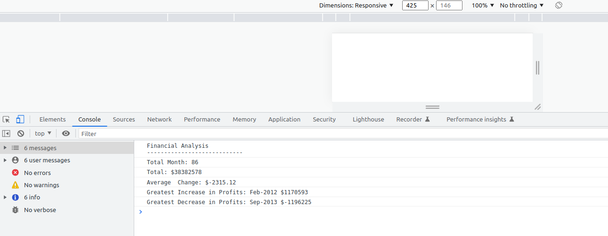
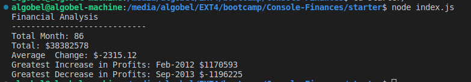

# Console-Finances

## Description

web-page : 

The finances variable is an array of arrays containing financial data, with each inner array containing a month and a profit or loss amount.
The find_total_months function takes an array of finances data as its input and returns the total number of unique months represented in the array.
The find_profit_losses function takes an array of finances data as its input and returns the total profit or loss over the given period of time.
The find_avg_of_change_profit_losses function takes an array of finances data as its input and returns the average change in profits or losses over the given period of time.
The find_greatest_profit_period function takes an array of finances data as its input and returns an array containing the month and amount of the greatest increase in profits over the given period of time.
The find_greatest_decrease_period function takes an array of finances data as its input and returns an array containing the month and amount of the greatest decrease in losses over the given period of time.

The code then prints the following information to the console:

- The total number of months in the financial data
- The total profit or loss over the given period of time
- The average change in profits or losses over the given period of time
- The month and amount of the greatest increase in profits over the given period of time
- The month and amount of the greatest decrease in losses over the given period of time

### find_total_months

This function is designed to find the total number of unique months represented in a given array of "finances" data.

#### Parameters
- `finances`: an array of finances data, where each element is a sub-array containing a month and a profit or loss amount.

#### Return value
The function returns the total number of unique months represented in the array.

#### Example
```JavaScript
find_total_months([["Jan", 100], ["Feb", 50], ["Mar", 75], ["Apr", 25]])
Output: 4
```


### find_profit_losses

This function is designed to find the total profit or loss over a given period of time, based on a given array of "finances" data.

#### Parameters
- `finances`: an array of finances data, where each element is a sub-array containing a month and a profit or loss amount.

#### Return value
The function returns the total profit or loss over the given period of time.

#### Example
```JavaScript
find_profit_losses([["Jan", 100], ["Feb", 50], ["Mar", 75], ["Apr", 25]])
Output: 250
```


### find_avg_of_change_profit_losses

This function is designed to find the average change in profits or losses over a given period of time, based on a given array of "finances" data.

#### Parameters
- `finances`: an array of finances data, where each element is a sub-array containing a month and a profit or loss amount.

#### Return value
The function returns the average change in profits or losses over the given period of time.

#### Example

```JavaScript
find_avg_of_change_profit_losses([["Jan", 100], ["Feb", 50], ["Mar", 75], ["Apr", 25]])
Output: 12.5
```
### find_greatest_profit_period

This function is designed to find the month and profit amount corresponding to the greatest increase in profits over a given period of time, based on a given array of "finances" data.

#### Parameters
- `finances`: an array of finances data, where each element is a sub-array containing a month and a profit amount.

#### Return value
The function returns an array containing the month and profit amount corresponding to the greatest increase in profits over the given period of time.

#### Example
```JavaScript
find_greatest_profit_period([["Jan", 100], ["Feb", 50], ["Mar", 75]])
Output: `["Mar", 75]`

```


## find_greatest_decrease_period

This function is designed to find the month and loss amount corresponding to the greatest decrease in losses over a given period of time, based on a given array of "finances" data.

#### Parameters
- `finances`: an array of finances data, where each element is a sub-array containing a month and a loss amount.

#### Return value
The function returns an array containing the month and loss amount corresponding to the greatest decrease in losses over the given period of time.

#### Example
```JavaScript
find_greatest_decrease_period([["Jan", -100], ["Feb", -50], ["Mar", -75]])
Output: `["Mar", -75]` 
```

## Installation

1. Clone the repository to your local machine:
```link
https://github.com/niwantha33/Console-Finances
```

2. Navigate to the root directory of the repository:
``` cd Console-Finances```

3.  Then run the index.html file using Live Server 


#### or 

1. Install the required dependencies:

```npm install```


2. Run the code:
```node index.js```


## Credits

- [w3schools](https://www.w3schools.com/js/js_functions.asp) for JavaScript function.
- [JavaScript](https://developer.mozilla.org/en-US/docs/Web/JavaScript/Guide/Functions) for JavaScript function
- [node](https://nodejs.dev/en/learn/run-nodejs-scripts-from-the-command-line/) for node.js


